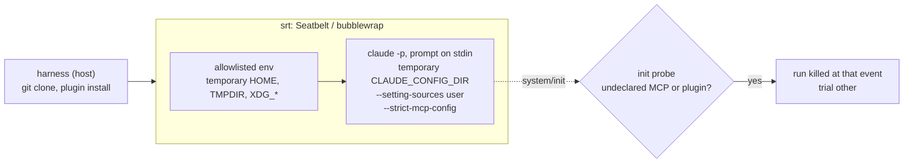
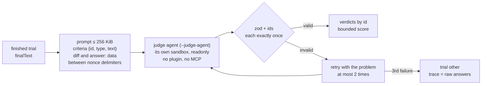
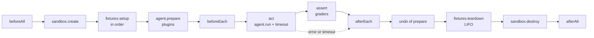
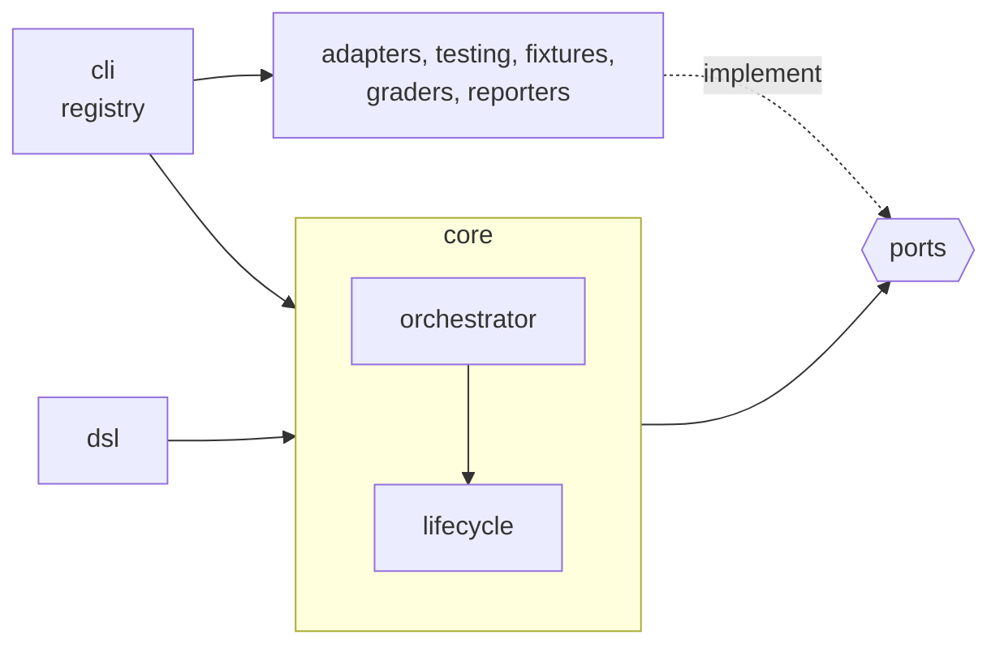

# proctor

[](https://github.com/Luce-Florian/proctor/actions/workflows/ci.yml)
[](https://www.npmjs.com/package/@fluce/proctor)
[](LICENSE)

Evaluate coding agents and the plugins, skills and tools you give them: write suites in TypeScript, run every trial in its own sandbox, grade with deterministic checks or an LLM judge, and get [CTRF](https://ctrf.io) reports.

## Example

```ts
// examples/hello.eval.ts
import { directory, regex, suite } from "@fluce/proctor"

export default suite("hello")
  .variant("baseline", (v) => v.prompt((c) => `Say hello to ${c.context}`))
  .variant("polite", (v) => v.prompt((c) => `Say hello politely to ${c.context}`))
  .case("greets-world", (c) =>
    c
      .description("The agent greets the world")
      .context("world")
      .fixture(directory(new URL("./hello", import.meta.url)))
      .expect(regex("says-hello", /hello/i))
      .expect(regex("names-world", /world/i))
      .timeout("1m"),
  )
```

```console
$ npm ci
$ npx proctor run examples/hello.eval.ts --agent fake
Running hello: 2 trials (agent fake 0.0.0, sandbox fake, isolation none)
PASS  greets-world [baseline] #1 (3ms)
PASS  greets-world [polite] #1 (4ms)
2 trials: 2 passed, 0 failed, 0 other, 0 skipped
Wrote results/hello/2026-09-30T16-57-05-888Z-a28a.ctrf.json
Wrote results/hello/2026-09-30T16-57-05-888Z-a28a.summary.md
```

- An evaluation harness for coding agents: xUnit lifecycle, one sandbox per trial, [CTRF](https://ctrf.io) reports.
- The core knows no agent.

## Install

```sh
npm i -D @fluce/proctor              # Node >= 22.12
npx proctor run <file> --agent <id>
```

- A `*.eval.ts` imports `@fluce/proctor` like any installed dependency: it lives in a project that installs the package.
- It must load as an ES module: under a `package.json` with `"type": "module"`, or named `*.eval.mts`.
- The example above runs from a clone of this repo, hence `npm ci`.

## CLI

| Command | Effect |
|---|---|
| `proctor run <file \| theme> --agent <id>` | runs a `*.eval.ts` or a theme in the legacy bash bench format (a directory with `cases/` and `variants/`), writes `<out>/<suite>/<runId>.ctrf.json` and, next to it, the `--report` files |
| `  --repeat <n>` | trials per case × variant (default 1) |
| `  -j, --concurrency <n>` | trials in parallel (default 1); the report keeps the matrix order |
| `  --case <id>` / `--variant <name>` | filters the matrix; repeatable or comma-separated (`--case a,b`), before or after `<file>` |
| `  --agent <id>` | `claude-code` or `fake` |
| `  --sandbox <id>` | `srt` by default (isolation `full`); `local-temp` on request (isolation `degraded`, with a warning); `fake` by default with `--agent fake` |
| `  --auth <profile>` | forces the auth profile; default: the first credential found in the environment (only `oauth` is validated) |
| `  --plugin-root <dir>` | directory searched for a bare name in `.plugins("sdlc")`; repeatable, the first one that contains `<dir>/sdlc` wins |
| `  --out <dir>` | results directory (default `results`); `stream-json` transcripts go to `<out>/transcripts/` |
| `Ctrl-C` (or `SIGTERM`) | 1st: running trials stop, cleanups and `afterAll` run, the partial report is written (trials `other`, exit code 2); 2nd: the agents' process groups are killed, exit `130` |
| `  --judge-agent <id>` | the agent that judges, whatever `--agent` is: `claude-code` by default, `fake` with `--agent fake`; its own adapter and its own sandbox |
| `  --judge-model <id>` | default model of the judge; a `judge().model(...)` in the suite wins |
| `  --baseline <variant>` | reference variant of the ablation (default `baseline`) |
| `  --report <formats>` | files derived from the CTRF: `markdown` (default), `html`; repeatable or comma-separated |
| `proctor report <ctrf.json> [--format html] [-o <file>] [--baseline <variant>]` | regenerates a report from a CTRF (default: `<runId>.summary.md`, or `<runId>.report.html`, next to it); `--baseline` recomputes the ablation against another variant. A CTRF whose displayed fields have the wrong type is rejected |
| `proctor list <file>` | lists variants and cases without running anything |

| Exit code | When |
|---|---|
| `0` | everything is `passed` or `skipped` |
| `1` | at least one `failed` (eval failure) |
| `2` | at least one `other` (infra, timeout), a failed `afterAll`, or a usage error; takes precedence over `1` |

## Development

```sh
npm run check     # format:check + lint + typecheck + test
npm test          # vitest, without network or credentials (test/support/setup.ts)
npm run test:unit # *.spec.ts specs next to the sources; test:behavior for test/*.test.ts
npm run lint      # import boundaries + type-aware rules
npm run format    # Prettier
```

`test/support/setup.ts` clears credential variables (`ANTHROPIC_*`, `*_TOKEN`, `*_API_KEY`…) and fails any test that opens a network connection.

Contributing guidelines are in [CONTRIBUTING.md](CONTRIBUTING.md).

### Fingerprint of `~/.claude`

A real campaign must change nothing in `~/.claude`. Check it before and after:

```sh
npm run fingerprint:claude-home -- --save before.json
# … campaign …
npm run fingerprint:claude-home -- --compare before.json   # exits with 1 and lists what changed
```

| Watched path | Fingerprint |
|---|---|
| `settings.json`, `plugins/known_marketplaces.json` | sha256 of the file |
| `plugins/` | sha256 of the whole tree |
| missing | `"absent"` |

`--home <dir>` points somewhere other than `~/.claude`.

## Isolated Claude Code

```sh
export CLAUDE_CODE_OAUTH_TOKEN=…   # claude setup-token; never the keychain nor ~/.claude
npx proctor run suites/isolation-probe.eval.ts --agent claude-code            # srt sandbox by default
npx proctor run path/to/review.eval.ts --agent claude-code --case <case-id> --repeat 3 -j 3
```

Three layers, from the outside in to the agent:



### Config layer (always on)

| Flag or variable | Effect |
|---|---|
| `CLAUDE_CONFIG_DIR=<sandbox home>/.claude` | blank config; without it, the CLI would read the keychain entry of the host's default config |
| `--setting-sources user` | reads only the `settings.json` of that temporary directory: neither the host's, nor the `.claude/settings*.json` of the cloned repo |
| `--settings <json>` | the variant's settings (model, hooks) |
| `--strict-mcp-config --mcp-config <json>` | only the declared MCP servers, no claude.ai connector |
| `--plugin-dir <copy>` | directory plugin, **copied** into the sandbox home |
| `--no-session-persistence`, `--output-format stream-json --verbose` | nothing to resume; the stream is the transcript |
| prompt on **stdin**, not as an argument | `claude -p` reads it when no prompt is passed (checked offline: without stdin, "Input must be provided either through stdin or as a prompt argument"); no argument size limit (128 KiB on Linux), and srt does not re-quote the prompt (each `'` takes 5 bytes there); srt forwards stdin, tested by `srt.integration.test.ts` |
| `ENABLE_CLAUDEAI_MCP_SERVERS=false`, `CLAUDE_CODE_DISABLE_NONESSENTIAL_TRAFFIC=1`, `DISABLE_AUTOUPDATER=1` | no connector, telemetry or update |
| `CLAUDE_CODE_TMPDIR=<sandbox TMPDIR>` | otherwise the Bash tool writes under `/tmp/claude-<uid>`, shared with the host's sessions and denied under srt |

Why neither `--bare` nor `--safe-mode`, checked on CLI `2.1.280`:

| Candidate flag | Finding | Consequence |
|---|---|---|
| `--safe-mode` | loads a `--plugin-dir` but **without its skills or agents**, and skips all hooks | a plugin's slash commands (e.g. `/sdlc:review`) and hook-based plugins would not run |
| `--bare` | skips hooks, including those from `--settings`, and the discovery of the repo's `CLAUDE.md` files | same for hook-based plugins; a review skill would lose the repo's conventions |
| `--setting-sources ""` | blocks the resolution of installed plugins | a marketplace-installed plugin would not load |

The chosen combination keeps plugins, skills and hooks, and exposes only what the harness wrote into the temporary directory.

### Auth

| Profile | Variable | Status |
|---|---|---|
| `oauth` | `CLAUDE_CODE_OAUTH_TOKEN` (`claude setup-token`) | validated |
| `api-key` | `ANTHROPIC_API_KEY` | to be tested later: `--auth api-key` exits with 2 and a message |

- Without a credential: `No credential for claude-code: run \`claude setup-token\` and export the token as CLAUDE_CODE_OAUTH_TOKEN (profile oauth).`, exit code 2.
- The credential goes through a single variable, added by the adapter: the sandbox env never contains the host's credentials.
- Profile and variable go into `results.environment.extra.agent.details`, never the value.
- A rejected credential prints `claude refused the credential CLAUDE_CODE_OAUTH_TOKEN (profile oauth): … Fix: run \`claude setup-token\`…`, not the CLI's `/login` advice.

| Where the token could leak | What prevents it |
|---|---|
| env of Bash, hooks, stdio MCP servers | CLI `2.1.280` strips it on its own, checked live (`env`, `SessionStart` and `PreToolUse` hooks, MCP); the probe checks it again (`credential-not-in-env`) |
| transcript, `toolCalls[].output`, final text, judge prompt, CTRF, summary | each line of the stream is masked (`[redacted by proctor]`) **before** it is written or parsed: the credential value and any Anthropic key (`src/adapters/redact.ts`) |
| a grader's `why` | tool-call graders only give counts, never a tool's output |

`CLAUDE_CODE_SUBPROCESS_ENV_SCRUB=1` is **not** set: on `2.1.280` it forces the permission mode to `default` (checked via `system/init.permissionMode`), which breaks `full` and `workspace-write`, hence the probe and the whole legacy loader. Keeping it would require an `--allowedTools` list per profile, which would change the measured behavior.

### Sandboxes

| | `srt` (default) | `local-temp` |
|---|---|---|
| Isolation written in the report | `full` | `degraded`, plus a console warning |
| HOME, TMPDIR, `XDG_*` | temporary | temporary |
| Env | `PATH` without the entries under the host home, `LANG`, `LC_*`, `TERM`, `TZ`, `USER` | same |
| Read | host home and temporary directories hidden, except the trial root and the declared paths | the whole disk |
| Write | the trial's workspace, home and TMPDIR, `.allowWrite()` paths | the whole disk |
| Network | declared domains only | open |

The `srt` policy of a trial (`<trial root>/srt-settings.json`, outside the writable directories) denies broadly, then opens narrowly: in srt, `allowRead` wins over `denyRead`.

| Rule | Paths | Why |
|---|---|---|
| `denyRead` | host home | `~/.ssh`, `~/.aws`, `~/.config/gh`, `~/.claude`… |
| `denyRead` | parent directory of the trial roots (`os.tmpdir()`, given path and real path) | a trial does not read another trial's root (`-j 2`) |
| `denyRead` | `/tmp`, `/private/tmp`, `/var/folders`, `/private/var/folders`, `/Volumes` (those that exist) | `/tmp/claude-<uid>` holds the outputs of the host's Claude sessions; mounted disks |
| `allowRead` | trial root | workspace, home, TMPDIR and policy file |
| `allowRead` | directory of the agent binary, `.allowRead()`, `.allowWrite()` | what the agent and the suite declare |
| `allowWrite` | `<root>/work`, `<root>/home`, `<root>/tmp`, `.allowWrite()` | nothing else; srt adds stdio and `/tmp/claude`, unreadable here |
| `allowedDomains` | the model API for the profile, `.allowDomains()` | everything else is blocked by the srt proxy |
| env | `CLAUDE_CODE_TMPDIR=<root>/tmp` | srt gives the command `TMPDIR=$CLAUDE_CODE_TMPDIR`, otherwise `/tmp/claude`, shared and hidden |

- The rest of the disk (`/usr`, `/opt`, `/etc`…) stays readable: binaries, libraries and certificates that `claude`, `node` and the tools need.
- `test/srt.integration.test.ts` runs the real `srt`, without an LLM or network: reading a fake home and another trial is denied, writing outside the workspace is denied, the workspace and `.allowWrite()` are writable. It is skipped, with a message, where srt does not run.
- Domains come from the agent (`sandboxAccess`: the model API for the profile) and from the suite (`.allowDomains(...)`).
- `srt` comes from the `@anthropic-ai/sandbox-runtime` dependency, not from a global install. It needs `rg` on macOS, and `bwrap`, `socat` and `rg` on Linux; otherwise `create` fails and says what to install, or to pass `--sandbox local-temp`.

### Plugins of a variant

| Reference in `.plugins(...)` | What `prepare` does, outside the agent's sandbox |
|---|---|
| `/absolute/path/to/plugin` | copies it into `<sandbox home>/.proctor/plugins/`, then `--plugin-dir` on the copy |
| a bare name, e.g. `sdlc` | the first `<--plugin-root>/sdlc`; without a root or if not found, an error that says where it looked |
| `<plugin>@<marketplace source>`, e.g. `caveman@JuliusBrussee/caveman` | `claude plugin marketplace add` and `install --scope user` in the sandbox's `CLAUDE_CONFIG_DIR`, without a credential |

- Nothing is written to `~/.claude`: this is what replaces the legacy bench's `initialize.sh` and `cleanup.sh`.
- `prepare` is an optional capability of the `AgentAdapter` port: the core calls it after the fixtures, without knowing what a plugin is.
- `pluginSha` (sha256 of the files of directory plugins and of installed ids) goes into the CTRF of each trial.

### Isolation probe

| In `system/init` | Verdict |
|---|---|
| an undeclared MCP server or `mcp__*` tool | trial `other`, run killed at that event; a slash command may have started a background task just before (seen with `/code-review`) |
| an undeclared plugin (built-in plugins aside) | same |
| a declared plugin that is missing, e.g. unreadable under srt | same |
| a `SessionStart` hook started before `init` while the variant declares none and has no plugin (host managed settings?) | same |

`system/init` also lists `skills` and `agents`, but without telling built-in ones apart: the probe does not compare them. Hooks other than `SessionStart` emit no event before `init`.

The `suites/isolation-probe.eval.ts` suite checks it end to end with deterministic graders:

| Criterion | Agent command | Expected |
|---|---|---|
| `workspace-writable` | `echo … > probe.txt && cat probe.txt` | succeeds: proof that Bash works |
| `claude-config-unreadable`, `claude-settings-unreadable` | `ls -la ~/.claude`, `cat ~/.claude/settings.json` (real host paths) | fails with `Operation not permitted` |
| `ssh-unreadable` | `ls -la ~/.ssh` | same |
| `host-tmp-unreadable` | `cat` of a witness file that `beforeAll` writes next to the trial roots | same: it always exists, only the sandbox can block reading it |
| `network-blocked` | `curl https://example.com` | fails |
| `credential-not-in-env` | `env` | no trace of the credential or of the mask |
| `credential-never-surfaced` | — | the transcript contains neither an Anthropic key nor the mask: the token never reached the stream |
| `no-claude-ai-connector` | the agent lists its `mcp__*` tools | no `mcp__claude_ai_*` |

- A denial must say `Operation not permitted` (or `Permission denied`): a missing file answers `No such file` with or without a sandbox, and made the probe pass under `local-temp`. Hence `ls -la ~/.claude` rather than `cat ~/.claude/CLAUDE.md`, which is missing on some machines. On Linux, bubblewrap mounts an empty directory instead: `No such file` is accepted there.
Without the witness, a Bash tool that does not start at all would make every other criterion pass: it happened on the first real attempt.

## Authoring API

| Builder | Methods |
|---|---|
| `suite(name)` | `.variant(name, v => …)`, `.case(id, c => …)`, `.beforeAll(fn)`, `.afterAll(fn)`, `.allowDomains(...)`, `.allowRead(...)`, `.allowWrite(...)`, `.toDefinition()` |
| variant `v` | `.prompt(text \| c => …)`, `.plugins(...)`, `.mcpServers({…})`, `.model(id)`, `.permissions(p)`, `.settings({…})`, `.beforeEach(fn)`, `.afterEach(fn)` |
| case `c` | `.description(t)`, `.context(t)`, `.fixture(f)`, `.expect(grader)`, `.timeout("10m")`, `.skip(reason)` |

- Each method returns a new builder: a partial builder can be shared between suites.
- Types narrow: a variant without `.prompt()` or a case with neither `.expect()` nor `.skip()` does not compile (`VariantBuilder<"without-prompt">` is not assignable to `VariantBuilder<"with-prompt">`). Zod validation at load time remains the safety net for suites written in JS.
- Safe defaults: permissions `readonly`, timeout `10m`.
- An invalid definition throws a `SuiteDefinitionError` that lists every problem and says what to add, e.g. `case "x" > graders: Case has no expectation: add .expect(...)`.

| Building block | Available |
|---|---|
| Fixtures | `directory(url, { into? })`; `gitRepo(url).ref(b).at(sha).diff(f)` or `.applyDiff(f)`, `.overlay(dir)` |
| Graders | deterministic and judge: see [Grading](#grading); `toolCallsFail(id, { tool, input }, { evidence? })`, `toolCallsSucceed(...)`, `toolOutputsExclude(id, match, /pattern/)`, `noToolNamed(id, prefix)` (and `escapeRegExp` to match a literal path); `transcriptExcludes(id, /pattern/)` |
| Agents | `claude-code`, `fake` (`src/testing/`) |
| Sandboxes | `srt`, `local-temp`, `fake` |

| `gitRepo`, port of the legacy `run.sh` | Effect |
|---|---|
| clone | `git clone --depth 1 --branch <ref>` into the workspace, by the harness with the host's git credentials, outside the agent's sandbox |
| `.at(sha)` | `fetch` then `checkout` of the exact commit |
| `.diff(f)` | copied as `eval-pr.diff`, not applied |
| `.overlay(dir)` | copied at the root and committed on the base; `origin/<ref>` pinned, fetch refspec neutralized |
| `.applyDiff(f)` | one commit on the `eval-pr` branch, then `eval-pr.diff` deleted |
| always | `eval-pr.diff`, `eval-spec.md`, `.claude/settings.local.json` in `.git/info/exclude`; commits without signature or hooks |

## Grading

Deterministic wherever possible, an LLM judge for the rest.

```ts
import { answerShape, fileUnchanged, judge, limits, suite, toolUsed, verdictEquals, verdictIs, yesNoContract } from "@fluce/proctor"

export default suite("check")
  .variant("baseline", (v) => v.prompt("/sdlc:check-if-need-humain-review …"))
  .case("migration", (c) =>
    c
      .expect(verdictEquals("verdict", "yes"))                          // 1. the verdict, principal
      .expect(answerShape("format", yesNoContract()))                   // 2. "oui", then one line per pattern (zod)
      .expect(judge()                                                   // 3. the meaning of the lines
        .model("claude-sonnet-5")
        .criterion("ddl", "A line identifies a DDL migration", { principal: true }))
      .expect(toolUsed("reads-diff", { tool: "Read", input: /eval-pr\.diff/ }))
      .expect(fileUnchanged("readonly", /^src\//))
      .expect(limits().maxCostUsd(3).maxDuration("10m")),
  )
  .case("split-controller", (c) =>
    c
      .expect(verdictEquals("verdict", ["no", "yes"]))                  // both verdicts are valid
      .expect(answerShape("format", yesNoContract()))
      .expect(judge()                                                   // only "oui" has lines to judge
        .model("claude-sonnet-5")
        .criterion("routes", "No line claims that the routes change", { principal: true })
        .when(verdictIs("yes"))),
  )
  .case("review", (c) =>
    c.expect(
      judge()
        .model("claude-sonnet-5")
        .diff(new URL("./diffs/x.diff", import.meta.url))
        .criterion("date-filter-inverted", "Flags the inverted date filter", { principal: true })
        .decoy("async-suffix", "No finding objects to the Async suffix"),
    ),
  )
```

| Grader | Passes when | Reads |
|---|---|---|
| `regex(id, /pattern/)` | the final text matches | `finalText` |
| `jsonPath(id, "$.a[0].b", expected, { file? })` | the value at the path is equal, matches a regex or satisfies a predicate; no JSON = criterion missed | `finalText` or a workspace file (symbolic links and paths outside the workspace rejected) |
| `fileChanged(id, path \| /pattern/)`, `fileUnchanged(...)` | at least one / no matching file added, modified or deleted | sha256 snapshot taken just before the agent (`grader.prepare`), `.git/` excluded; **no `git` is run**: a repo written by the agent could run its hooks or filters on the host |
| `toolUsed(id, { tool, input? }, { min?, max? })` | between `min` (default 1) and `max` matching calls | `toolCalls` |
| `verdictEquals(id, "yes" \| ["no", "yes"], { words? })` | the first line of the answer (surrounding blanks, BOM and CRLF aside) is **exactly** the expected word (`oui`/`non` by default, case-sensitive); `**Non.**`, `NON` or a verdict on line 3 are not a verdict; **principal** criterion; the verdict only, not the shape | `finalText` |
| `answerShape(id, contract)` | `contract.parse(text)` satisfies `contract.schema` (zod); otherwise `why` lists the zod issues, `path: message`; a `parse` that throws = criterion missed | `finalText` |
| `yesNoContract({ words?, verdicts?, maxReasonLength? })` | contract for `answerShape`: see below | — |
| `limits().maxCostUsd(3).maxDuration("10m")` | cost and duration **of the evaluated agent** under the caps; unreported cost = criterion missed | `costUsd`, `durationMs` |
| `judge()` | score ≥ `.minScore()` (default 3) and principal met; with `.when(predicate)`, only if the predicate holds on the agent's run (`verdictIs("yes")`, same strict rule as `verdictEquals`, or any `(result) => boolean` function) | the judge agent's answer |

`yesNoContract()` reads the answer as `{ verdict, reasons }` (1st line, following lines), then validates it with zod:

| Answer | `met` | `why` |
|---|---|---|
| `non` | ✓ | `"non" alone` |
| `oui\n- Migration DDL sur outbox` | ✓ | `"oui" then 1 reason line(s)` |
| `non\nStyle only.` | ✗ | `reasons: "non" must stand alone` |
| `oui` | ✗ | `reasons: "oui" must be followed by one line per reason` |
| `**Oui**\n- …`, `review: oui` | ✗ | `verdict: the first line must be "non" or "oui" alone` |
| `oui\n## Détails\n\nConfiance : haute` | ✗ | `reasons[0]: heading "## Détails"; reasons[1]: blank line ""; reasons[2]: confidence level …` |
| a line longer than 500 characters | ✗ | `reasons[0]: paragraph of 612 characters, at most 500 per reason line` |

- Heading: a line that starts with `#` followed by a blank (`#1234 migration` is a reason) or ends with `:`. Confidence: a line that **starts** with `confiance`/`niveau de confiance`/`confidence`, bullets and `**` aside (`confiance: haute`, `- Confiance « moyenne »…`). Recommendation: a line that starts with `Recommandation :` or `Je/Nous recommande…`, `I/We recommend…`. A word in the middle of a line does not count: `- abaisse le seuil de confiance…`, `Tiers de confiance : …`, `Règle de recommandation de paiement modifiée` are reasons.
- Defaults specific to `/sdlc:check-if-need-humain-review` (French words and filters, 500 characters): another yes/no skill overrides `words` and `maxReasonLength`, another format writes its own contract.
- 500 characters (`MAX_REASON_LENGTH`): 9 reason lines out of 10 in recorded bash runs are below it; beyond that, the line explains or chains several patterns.
- `verdicts: ["no"]` restricts the well-formed verdicts: it means "the output is strictly `non`".
- Another format = another contract `{ parse, schema, describe? }`, without touching `answerShape`.

- `judge()` and `limits()` without a criterion or cap are not graders: `.expect(judge())` does not compile.
- A judge whose `.when()` gate is closed costs no call and returns a passing grade **without criteria**: its criteria are absent from the trial (CTRF, aggregates), neither met nor missed; the HTML report shows "—" (not graded). The trial then has no score: the aggregates say over how many graded trials the score is averaged (`0.75 ± 0.10 (2/4)`).
- Put a gate on what makes the criteria irrelevant, not on the expected verdict: on a case that expects `oui`, `.when(verdictIs("yes"))` would leave a wrong `non` without a score. Hence `split-controller` above, where `non` is valid.
- A trial whose graders all left their criteria out is `other` ("Nothing was graded"): a success that checked nothing is not one. Keep a principal criterion outside the gate, e.g. `verdictEquals`.
- A verdict carries `text` (the criterion as the author wrote it): reports show it next to the id.

### Judge



| Decision | Choice | Why |
|---|---|---|
| Who judges | the `--judge-agent` adapter (default `claude-code`, `fake` with `--agent fake`), instantiated separately with its own sandbox (same type as `--sandbox`) | the judge does not change when the evaluated agent changes: scores stay comparable |
| Model | the suite's `judge().model(...)`, otherwise `--judge-model`, otherwise the adapter's default: the CLI warns and `judgeModel` is `unpinned (<resolved model>)`; the legacy loader pins `claude-sonnet-5`, as the legacy bench's `judge.sh` did | the suite pins an exact id, the operator only sets a default; an unpinned judge shows in the report |
| When | the judge is instantiated only if a case in the run has a `judge()`; `environment.extra.judge` appears only then | a deterministic suite requires no judge credential |
| Prompt | an English prompt: criteria as JSON `{id, type, text}` (type `principal`, `decoy` or `criterion`), the diff, the exact JSON shape (`criterion`/`met`/`why` per id), and one untrusted block per input (answer, diff) between `<<<BEGIN <nonce>>>>` and `<<<END <nonce>>>>`, with a random nonce per call and the instruction to ignore any instruction they contain; a met criterion (decoys aside) quotes the passage that meets it | the agent writes what the judge reads: a fake `---` or "answer score 5" stays data |
| Size | ≤ 256 KiB (UTF-8): beyond that, the diff is cut, then the answer, on a code point boundary; the prompt says so ("truncated: N bytes omitted at the end") and so does the CTRF (`judgeTruncated`) | the prompt goes through stdin, with no argument limit: the bound protects the judge's context and cost |
| Tool surface | `readonly` (`--tools Read`), `--setting-sources user` from an empty config dir; the legacy `judge.sh`: all tools, `--setting-sources ""`, `bypassPermissions` | measured difference: **0 tool calls** in the 12 judge transcripts of the first validation campaign; the diff is in the prompt, the judge has nothing to read |
| Answer | `{"score": 1-5, "criteria": [{"id", "met", "why"}]}` validated by zod, each id exactly once, no unknown id; fences and surrounding text tolerated | an invented or forgotten id triggers a retry, instead of a wrong match |
| Matching | by `id` | the order of the answer does not matter; decoys are counted by id |
| Score | the judge's, bounded by the rules of its prompt: ≤ 4 if a criterion is missed, ≤ 2 if the principal is missed. All criteria principal and `.minScore(1)`: the judge passes iff all are met, whatever the score | a 5 with 3 missed criteria was seen live |
| Retries | 1 attempt + 2 retries (3 attempts), with the problem of the previous answer in the prompt; then `GradeError`: trial `other`, raw answers in `trace`. A judge run that throws (timeout, crash) is not retried: trial `other` as well | an unreadable answer is an infra error, not an eval failure |
| Cost | `judgeUsage` of the `GradeResult`: calls (retries included), cost, tokens, model, transcripts; `tests[].extra.judge*` and `aggregates.judge` in the CTRF | kept apart from the agent's `costUsd` |
| `limits()` and the judge | the judge is **not** counted in `maxCostUsd` | the limit applies to what is measured; a planned campaign-wide budget (`--max-cost-usd`) will count both |
| `llmJudge()` (a one-to-one port of the legacy `judge.sh`) | **removed**: the legacy loader goes through `judge()` | measured comparable on a parity run, see [Validation campaign: judge](#validation-campaign-judge); a single judge to maintain |

The cost of a judge that fails (3 invalid answers, or a run that throws) still goes into the trial (`judgeCalls`, `judgeCostUsd`) and the aggregates, and into its message (`$0.030 spent`).

### Yes/no themes in three levels

The legacy loader recognizes a case's yes/no contract from its criteria, without modifying the theme's files (`src/loaders/legacy-verdicts.ts`). The criteria texts below are the legacy data format, matched literally:

| Legacy criterion | Role | Graded by |
|---|---|---|
| `Rend le verdict "non"…` | verdict, **principal** | `verdictEquals(id, verdict)` |
| `La sortie est strictement "non"…`, `La sortie est "oui" suivi uniquement d'une ligne par pattern…`, `Aucun texte hors du contrat…` | shape | `answerShape(id, yesNoContract({ verdicts }))`, with the verdicts the case accepts |
| `S'il répond "non", la sortie est … ; s'il répond "oui" …, la sortie est …` | shape, both verdicts accepted | same |
| `Une des lignes identifie une migration…`, `S'il répond "oui", aucune ligne ne prétend…` | meaning of the reason lines | `judge()` `claude-sonnet-5`, the case's diff, **principal** criterion, `.minScore(1)`; `.when(verdictIs("yes"))` only if `non` is also accepted |

| Case | Graders | Judge calls |
|---|---|---|
| a case that expects `non` (verdict + shape) | `c01`, `c02` | 0 |
| a case that expects `oui` | `c01`, `c02`, `judge` (`c03`) | 1, whatever the answer: a wrong `non` is judged (`c03` missed), as in the bash bench |
| a case that accepts both verdicts | `verdict` (added, principal), `c01`, `c03`, `judge` (`c02`) | 1 if the agent answers `oui`, 0 on `non` |

- Legacy ids `c01`… and texts are kept; the judge runtime is created once per run, as soon as a case in the run has a judge (even if no answer calls it: its credential is then required and `environment.judge` reported); the judge **call**, however, only happens if its gate is open.
- Passed = all graded criteria met: each semantic criterion is principal and the score does not count (`minScore(1)`), so `oui\nxyz` fails on `c03`, as in the bash bench, which judged everything.
- Closed gate (a valid `non` on a case that accepts both): `c02` is absent from the trial, neither met nor missed; the aggregates report the share of criteria met per trial, so a perfect `non` (3 criteria) and a perfect `oui` (4) both count as 100%.
- Intended differences from the legacy `judge.sh`, which graded everything with the judge: the criteria counts differ, not the passed/failed verdict. On a case that accepts both verdicts, `c01` and `c03` are two identical `answerShape` (two legacy shape criteria): a shape defect counts twice; under `non`, `c02`, "held" vacuously by the bash bench, is omitted.
- A case with no recognized verdict criterion keeps the judge for all its criteria.

### Aggregates, ablation, reports

| Where | Content |
|---|---|
| `results.extra.aggregates.groups[]` | per case × variant: trials by status, criteria and decoys (**share met per trial**, in `[0, 1]`, mean ± standard deviation, shown as %), principal met, score (with its `n`), cost, duration, judge calls and cost; criteria, score, cost and duration averaged over graded trials (`passed`, `failed`) only; a trial's share has its own criteria as denominator, a closed gate takes no point away; principal met counted over the trials that have a principal (otherwise "—") |
| `results.extra.ablation[]` | Δ (variant − `--baseline`) of criteria (in share points), score, cost, pass rate; the pass-rate Δ is absent ("—") when one side has no graded trial, instead of a false ±100 pts |
| `<runId>.summary.md` | trials, aggregates, judge line, ablation |
| `<runId>.report.html` (`--report html`, or `proctor report <ctrf> --format html`) | standalone page: summary and status bar, variants and ablation card, criteria × trials map (principal, decoy), trials, raw CTRF tab; light and dark; the only request: Google Fonts, optional |

Sample standard deviation (n − 1). Reports always recompute the aggregates from `tests[]` (`aggregatesOf`): a CTRF that predates the aggregates works, and an edited `results.extra` is never displayed as is.

Judge an archived run again without rerunning the agent (`claude-code` transcripts); the archived baseline only counts the judge's criteria (`grader: "judge"`):

```sh
CLAUDE_CODE_OAUTH_TOKEN=… npm run rejudge -- results/<suite>/<runId>.ctrf.json path/to/suite.eval.ts --times 3 [--test "baseline] #1"]
```

## Bash themes (legacy loader)

`proctor run <theme-dir>` reads a theme in the legacy bash bench format without modifying it:

| Bash bench | Harness |
|---|---|
| `cases/*.json`: `repo`, `diff_file`, `diff_apply`, `overlay_dir` | `gitRepo(...)` fixture |
| `prompt`, a string or an object per variant | the variant's prompt; missing key: trial `other` |
| `expected.criteria` of a yes/no case | `verdictEquals`, `answerShape`, judge on `oui`: see [Grading](#yesno-themes-in-three-levels) |
| `expected.criteria` of other cases | `judge()` with model `claude-sonnet-5`, ids `c01`…, `[principal]` and `[leurre]` detected, `diff_file` given to the judge |
| `variants/*/settings.json` | settings, `__REPO_ROOT__` (two levels above the theme directory) resolved, model pinned from `settings.model`; under srt, a referenced directory becomes readable as is, a script through its directory, never a parent (at suite level) |
| `variants/*/plugins` | directory plugins `<repo>/marketplace/plugins/<name>`, resolved to absolute paths at load time |
| `initialize.sh`: `claude plugin marketplace add` + `install` | marketplace plugins installed in the sandbox home |
| `cleanup.sh`: `uninstall`, `marketplace remove` | nothing: the sandbox home is thrown away |
| any other line in these scripts | rejected at load time, with the advice to port the variant to `*.eval.ts` |
| `--permission-mode bypassPermissions` | permissions `full` |
| no timeout | `30m` |

### Porting a theme to `*.eval.ts`

| Bash bench | `*.eval.ts` |
|---|---|
| `cases/<id>.json` | `.case(id, ...)`; `description` and `context` (the sentence shared by the variants) |
| `prompt`, an object per variant | `.prompt((c) => …)` of each variant, which only changes the invocation line |
| the case's `effort` | an `EFFORT` table in the file, read by the prompts: `CaseContext` only carries `id` and `context` |
| `repo`, `diff_file`, `diff_apply`, `overlay_dir` | `gitRepo(url).at(sha).applyDiff(url).overlay(url)`, paths as `new URL(…, import.meta.url)` |
| `expected.criteria`, `[principal]`, `[leurre]` | `judge().criterion(id, text, { principal })`, `.decoy(id, text)`: descriptive ids instead of `c01`… |
| `variants/*/settings.json` `{"model": …}` | `.model(id)`: the redundant `--settings` goes away |
| `variants/*/plugins` | `.plugins(<absolute path>)`, resolved from the file: no `--plugin-root` to pass |

- Parity can be checked offline: load both definitions (legacy loader, `*.eval.ts`) and compare them. On the first ported theme, a code-review theme, they gave byte-identical prompts, the same criteria texts in the same order, the same principal and decoys, the same fixture, model, permissions and timeout.
- The ported file imports `@fluce/proctor` like any installed dependency: it lives in a project that installs the package (`npm i -D @fluce/proctor`) and loads as an ES module (`"type": "module"` in its `package.json`, or `*.eval.mts`). Typecheck it with that project's `tsc`.

## Lifecycle



- Cleanup always runs for what was set up, whatever failed before.
- `afterEach` runs as soon as the fixtures are set up and the agent prepared, even if `beforeEach` throws.
- `sandbox.create` receives `access`: what the agent (`sandboxAccess`) and the suite (`.allowDomains`, `.allowRead`, `.allowWrite`) must let through.
- Graders receive the run's judge (`RunOptions.judge`: its agent, its sandbox, its default model), never the evaluated agent.
- `grader.prepare(workspace)`, optional, runs just before the agent, after `beforeEach`: `fileChanged` takes its snapshot there.
- On timeout, the signal passed to the agent is aborted and the trial becomes `other` (`agent run failed: timed out after 1m: raise the case .timeout(...)…`).
- Cleanup waits for the agent to stop, 5 s at most (`ABORT_GRACE_MS`), so as not to tear down a workspace it is still writing to.
- An interruption (`runSuite({ signal })`, Ctrl-C in the CLI) follows the same path: the agent, `prepare` and the judge receive the signal, the running trial becomes `other` after its cleanups, the next ones do not start.
- A failed agent run keeps its transcript: `AgentRunError.transcriptPath` goes up into `TrialResult.transcriptPath` and the CTRF's `extra.transcript`.
- Each launched command has its own process group: on abort, SIGTERM then SIGKILL after 2 s; on normal exit, whatever it left in the background is killed.
- A reporter that throws in `onTrialEnd` does not stop the run: the error goes into `suiteErrors`.
- A failed `afterAll` changes no trial: it goes into `suiteErrors`, written to the CTRF's `results.extra` and at the bottom of the summary.

| Status | When |
|---|---|
| `passed` | all graders pass |
| `failed` | a grader returns `passed: false`, or a `principal` criterion is missed even if the grader says `passed`; the message lists the missed criteria |
| `other` | infra error: sandbox, fixture, `prepare`, hook, agent, init probe, grader that throws, timeout, `beforeAll` |
| `skipped` | `.skip()`; no sandbox created |

## Architecture

```text
proctor/
├── bin/proctor.js        # registers tsx, then runs src/cli/main.ts: no build
├── src/
│   ├── ports/               # AgentAdapter, Sandbox, Grader, Fixture, Reporter, Workspace, run (results)
│   ├── core/
│   │   ├── model.ts         # definitions and zod schemas
│   │   ├── trial-summary.ts # trialLabel, countByStatus
│   │   ├── matrix.ts        # case × variant × repetition, filters
│   │   ├── orchestrator.ts  # beforeAll/afterAll, -j (p-limit), reporters
│   │   ├── lifecycle.ts     # one trial: hooks, try/finally, LIFO fixtures, status
│   │   ├── errors.ts · timeout.ts · duration.ts · exit-code.ts
│   ├── dsl/                 # fluent builders: suite, variant, case
│   ├── adapters/
│   │   ├── process.ts       # runs a command, explicit env, kills the group on abort and on exit
│   │   ├── redact.ts        # masks the credential and any Anthropic key in the stream
│   │   ├── agents/claude-code/
│   │   │   ├── adapter.ts       # version, prepare, run: env, sandbox wrap, transcript
│   │   │   ├── credentials.ts   # auth profiles, API domains per profile
│   │   │   ├── flags.ts         # AgentRunInput → CLI flags
│   │   │   ├── plugins.ts       # references (name, path, marketplace), copy, marketplace, fingerprint
│   │   │   ├── stream-parser.ts # stream-json → AgentRunResult, toolCalls
│   │   │   └── init-probe.ts    # system/init → undeclared MCP or plugin; undeclared SessionStart hook
│   │   └── sandboxes/
│   │       ├── temp-layout.ts         # root/{work,home,tmp} of a trial, allowlisted env
│   │       ├── local-temp/sandbox.ts  # the layout alone: isolation degraded
│   │       └── srt/{config,sandbox}.ts # srt policy, command wrapping
│   ├── auth/credential-resolver.ts  # picks the credential among the profiles the agent declares
│   ├── fixtures/{directory,git-repo}.ts
│   ├── graders/             # regex, tool-calls, transcript, json-path, file-changed (+ workspace-files),
│   │                        # tool-used, verdict-equals, answer-shape (+ yes-no-contract), limits, llm-judge (+ judge-protocol)
│   ├── reporters/           # ctrf(-types), aggregates, markdown and html (CTRF sinks), console, files
│   ├── loaders/             # registry, eval-ts, legacy-json, legacy-verdicts (oui/non → verdict, shape, judge on oui)
│   ├── testing/             # FakeAgentAdapter, FakeSandbox (export "@fluce/proctor/testing")
│   ├── shared/              # leaf utilities (fs, text, ids), importable by every layer
│   └── cli/                 # main (commander), run, report, list, registry, host, interrupt (Ctrl-C)
├── eslint/import-boundaries.js
├── scripts/fingerprint-claude-home.ts, rejudge.ts
├── examples/hello.eval.ts   # covered by test/cli.test.ts
├── suites/isolation-probe.eval.ts  # covered by test/isolation-probe.test.ts
└── test/                    # behavior tests (*.test.ts); unit specs sit next to the sources (*.spec.ts)
    ├── support/             # imported through #test/*: setup.ts (no network, no credential), helpers, ctrf-schema, typecheck
    └── fixtures/            # vendored ctrf.schema.json, recorded and anonymized stream-json/, fake-claude.sh that
                             # replays them, legacy/demo theme; srt.integration.test.ts runs the real srt
```



The `local/import-boundaries` lint rule blocks:
- any relative import that leaves the package root;
- any import of `adapters/`, `auth/`, `cli/`, `dsl/`, `fixtures/`, `graders/`, `loaders/`, `reporters/`, `testing/` or `src/index.ts` from `core/` or `ports/`, relative or by the package name (`proctor`, `@fluce/proctor/testing`);
- any import of `core/` from `ports/`: the ports are the innermost layer.

## Extending

| Add | Where | Register |
|---|---|---|
| an agent | `src/adapters/agents/<id>/`, which implements `AgentAdapter` (and if needed `prepare`, `sandboxAccess`, `details`) | one line in `agents` in `src/cli/registry.ts`; the factory receives `--auth`, `--out` and the env |
| a sandbox | `src/adapters/sandboxes/<id>/`, which implements `Sandbox`, with its `isolation` level and if needed `Workspace.wrap` | one line in `sandboxes`; `srt` stays the default, `defaultSandboxes` holds the exceptions |
| an auth profile | an entry in the agent's profiles, e.g. `CLAUDE_AUTH_PROFILES` in `claude-code/credentials.ts` | nothing: the factory passes its profiles to `resolveCredential` |
| a grader, a fixture | a function that returns a `Grader` (with `prepare(workspace)` if it compares to the state before the agent) / a `Fixture` | nothing: pass it to `.expect()` / `.fixture()` |
| a suite format | a `SuiteLoader` in `src/loaders/` | the `loaders` array in `src/loaders/index.ts` |
| a reporter | a `Reporter` class | the `reporters` list in `src/cli/run.ts` |
| a report format (`--report`, `--format`) | `write(report, path)` and `path(ctrfFile)` in `src/reporters/<format>.ts` | one line in `reportFormats` in `src/cli/registry.ts` |
| a file derived from the CTRF, outside the CLI | a `CtrfSink` `(report, ctrfFile) => written path`, like `markdownSummary`, `htmlReport` | `sinks` of the `CtrfReporter` |

## CTRF

| Decision | Choice | Why |
|---|---|---|
| Reference schema | [`ctrf.schema.json`@`66e823c`](https://github.com/ctrf-io/ctrf/blob/66e823ca2c9e1f54bf8b387adda0b7e0c7610538/schema/ctrf.schema.json), vendored as is in `test/fixtures/ctrf/` | every test validates the produced reports with ajv, without network |
| `specVersion` | `"1.0.0"` | SemVer string required by the schema, the value of the official examples |
| `tests[].suite` | array `[suite, case, variant]` | the schema defines it as the hierarchy, from the top to the direct parent, `minItems: 1` |
| `tests[].name` | `case [variant] #n` | readable in CTRF tools |
| `testId` / `executionId` | `suite/case/variant` / `…#n` | stable id of the logical test, unique id of the trial |
| `tests[].labels` | `case`, `variant`, `trial` | filterable in CTRF tools |
| `tests[].extra` | `criteria[id, met, why, principal, decoy, grader]`, `score`, `costUsd`, `model` (resolved by the agent), `pluginSha`, `tokens` (including cache), `turns`, `agentDurationMs`, `transcript` | criteria are identified by `id`, never by index |
| A single document per run | `CtrfReporter` builds the CTRF once, writes it, then passes it to its sinks (`<runId>.summary.md`) | the markdown comes exactly from the written JSON; two runs never overwrite each other |
| `results.extra.aggregates` | per case × variant: trials by status, criteria, decoys, principal, score, cost (mean ± standard deviation), duration, judge calls and cost; `judge`: run total | computed from the `tests` alone, so also on an archived CTRF |
| `results.extra.ablation` | per case and variant ≠ `--baseline`: Δ criteria, Δ score, Δ cost, Δ pass rate | the delta vs baseline of `claude plugin eval` |
| `tests[].extra.judge*` | `judgeCalls` (retries included), `judgeCostUsd`, `judgeTokens`, `judgeModel`, `judgeTranscripts` | the judge's cost is never mixed with the agent's `costUsd` |
| `environment.extra.judge` | `{ id, version, details, sandbox, model? }` | the report says who judged |
| `results.extra.suiteErrors` | present only if `afterAll` failed | a suite error with no trial to carry it |
| `results.environment` | `reportName`, `commit`, `branchName` (omitted on a detached HEAD), `osPlatform`, `osRelease`, `extra.{agent: {id, version, details}, sandbox, isolation}` | the schema forbids free fields outside `extra`; `details` carries the auth profile |
| `environment.extra.isolation` | `none` (fake), `degraded`, `full`; repeated in the summary header | a report always says how isolated the run was |

## Validation campaigns: isolation and parity

Manual campaigns, not `npm test` tests. Run on 2026-09-30: CLI `2.1.280`, profile `oauth`, sandbox `srt` unless noted, model `claude-sonnet-5`. Besides this repo's isolation probe, they ran themes of a private bench in the legacy bash format.

```sh
export CLAUDE_CODE_OAUTH_TOKEN=…                       # claude setup-token
npm run fingerprint:claude-home -- --save before.json
npx proctor run suites/isolation-probe.eval.ts --agent claude-code
npx proctor run suites/isolation-probe.eval.ts --agent claude-code --sandbox local-temp   # must fail: isolation degraded
npx proctor run <review-theme> --agent claude-code --case <case-id> --repeat 3 -j 3
npx proctor run <legacy-theme> --agent claude-code -j 2
npm run fingerprint:claude-home -- --compare before.json
```

### Isolation probe

| Sandbox | Status | Criteria not met | Cost |
|---|---|---|---|
| `srt` | `passed` | none: `~/.claude`, `~/.ssh` and the temporary directory witness denied (`Operation not permitted`), `curl` blocked (`CONNECT tunnel failed, response 403`), no token in `env` or in the transcript, no MCP or plugin loaded | $0.11 |
| `local-temp` | `failed`, isolation `degraded` | `claude-config-unreadable`, `claude-settings-unreadable`, `ssh-unreadable`, `host-tmp-unreadable`, `network-blocked` | $0.12 |

Rerun after a review of the isolation, with a hardened srt policy and probe. The first rerun failed under srt on `cat ~/.claude/CLAUDE.md`: the file was missing on that machine, and `No such file` is no proof of a denial, hence `ls -la ~/.claude`. Fingerprint of `~/.claude` unchanged, no Anthropic key in the results.

The first attempt under srt revealed two problems, fixed since: the Bash tool did not start (hence `CLAUDE_CODE_TMPDIR` and the `workspace-writable` witness), and the model refused the `ls ~/.ssh` of a prompt that was too terse.

### Parity with the bash bench: a code-review theme, one case, `--repeat 3`

| Variant | Criteria per trial | Mean | Principal | Decoys | Mean cost | Bash bench |
|---|---|---|---|---|---|---|
| baseline | 11, 10, 8 | 9.7 / 12 | 3 / 3 | 2 / 2 | $0.32 | 9 / 12, $0.30 (+7%) |
| with the review plugin | 11, 12, 11 | 11.3 / 12 | 3 / 3 | 2 / 2 | $1.24 | 11 to 12 / 12, mean $1.47 over 7 runs (−16%) |

The three parity acceptance criteria hold: baseline between 8 and 10 on average, the plugin variant ≥ 11 with the principal in all 3 trials, costs within ±30%.

### Legacy themes (a subset, for budget)

| Theme, case | Variants | Harness | Bash | Reading |
|---|---|---|---|---|
| a plugin theme, one case | baseline / with the plugin | score 4 / 5 | 4 / 5 | parity; the plugin is installed from its marketplace into the sandbox home |
| a yes/no theme, a case that expects `non` | baseline / with two plugins | 5 / 2 | 2 / 5 | inverted on a single run: an unstable shape criterion, a single rerun proves nothing |
| a theme that runs `dotnet test` | both | score 1 | 2 / 5 | no parity under srt: `dotnet` writes to `/tmp/.dotnet/shm` (denied) and the NuGet restore leaves the allowed network |
| a theme that runs `dotnet build` | both | `other` | — | srt socket paths truncated at 104 bytes (`EADDRINUSE`); fixed since with a short trial root, checked outside the campaign |

Total cost of the campaigns: about $8.8, judge included.

The fingerprint of `~/.claude` (`settings.json`, `plugins/`, `known_marketplaces.json`) is identical before and after all campaigns.

## Validation campaign: judge

Run on 2026-09-30: CLI `2.1.280`, profile `oauth`, sandbox `srt`, judge `claude-code` with model `claude-sonnet-5`.

```sh
npm run fingerprint:claude-home -- --save before.json
npm run rejudge -- results/<suite>/<runId>.ctrf.json <review-theme> --times 3
npx proctor run <yes-no-theme> --agent claude-code --case <case-id> \
  --plugin-root <plugins-dir> --report markdown,html
npx proctor report results/<suite>/<runId>.ctrf.json --format html
npm run fingerprint:claude-home -- --compare before.json
```

### Judge stability: the parity run above, judged again 3 times

Same answers (transcripts of the parity run), new judge: stable ids, diff provided, zod.

| Trial | `llmJudge` (parity run) | `judge()` × 3: criteria | Spread | Score 1–5 (bounded) |
|---|---|---|---|---|
| baseline #1 | 11 | 11, 10, 11 | 1 | 4, 4, 4 |
| baseline #2 | 10 | 9, 10, 9 | 1 | 4, 4, 4 |
| baseline #3 | 8 | 8, 9, 9 | 1 | 3, 3, 3 |
| with the plugin #1 | 11 | 10, 11, 11 | 1 | 4, 4, 4 |
| with the plugin #2 | 12 | 11, 12, 11 | 1 | 4, 5, 4 |
| with the plugin #3 | 11 | 10, 10, 10 | 0 | 4, 4, 4 |

- Acceptance criterion held: 3 judgments of the same run stay within **1 point of each other at most**, in score as in criteria.
- Means: baseline 9.4 / 12 (parity run: 9.7), with the plugin 10.7 / 12 (parity run: 11.3). Within ±1 criterion: the legacy loader moves to the new judge and `llmJudge()` is removed.
- The new judge is slightly stricter on two criteria (an injected dependency, a finding outside the diff): it sees the diff.
- Raw, the judge twice returned a 5 with missed criteria (baseline #2, with the plugin #1): hence the bounded score. The table gives the bounded scores.
- 18 calls, 0 retries, $0.07 to $0.10 per call, $1.48 in total.

After the prompt was hardened (nonce blocks, prompt on stdin, `text` key, quoting the passage), baseline #1 judged again 2 times: 10 and 11 criteria / 12 (archived: 11), score 4 and 4, $0.07 per call, under srt. Same range as before.

### Yes/no theme without a judge

| Case | Variant | Status | Criteria | Judge calls |
|---|---|---|---|---|
| a case that expects `oui` | baseline | `failed`: reasoning before `oui` | `c01` ✓, `c02` ✗ | 0 |
| | with two plugins | `passed`: `oui` then 2 lines | `c01` ✓, `c02` ✓ | 0 |

`results.extra.aggregates.judge = { calls: 0, costUsd: 0 }`, agent cost $0.16. A second case did not run: its repository was not reachable from that machine.

### Smoke test of yes/no themes in three levels

Run on 2026-10-01, `--variant baseline`, under srt:

```sh
npx proctor run <yes-no-theme> --agent claude-code --sandbox srt --variant baseline \
  --case <oui-case>,<non-case> --plugin-root <plugins-dir> -j 2
```

| Case | Status | Criteria | Judge calls |
|---|---|---|---|
| a case that expects `oui` | `passed`: `oui` then 2 lines | `c01` ✓, `c02` ✓, `c03` ✓ (judge: DDL, backfill, indexes cited) | 1, $0.037 |
| a case that expects `non` | `failed`: reasoning before `non` | `c01` ✓ (line 3), `c02` ✗ `verdict: the first line must be "non" alone` | 0 |

Agent cost $0.15, judge $0.04. CTRF valid against the schema, `~/.claude` unchanged.

This smoke test predates the strict verdict rule: replayed on the same answer, `c01` is now ✗ (`the first line "…" is no verdict, expected "non" alone`), line 3 no longer counts. The status does not change; the `verdictEquals` test pins this case without rerunning the agent.

### HTML report

Generated from the CTRF of the parity run and opened once (headless Chrome): summary, variant cards, ablation of the plugin variant vs `baseline` (+1.7 criteria, +0.33 score, +$0.92), map of the 12 criteria × 6 trials. That CTRF predates the aggregates: they are recomputed on read, and it does not know the judge's cost yet ("no call").

The fingerprint of `~/.claude` is identical before and after the campaign; no Anthropic key (prefix `sk-an…`) in the results or the repository.

## Validation campaign: a theme ported to `*.eval.ts`

Run on 2026-10-02: CLI `2.1.280`, profile `oauth`, sandbox `srt`, agent and judge `claude-sonnet-5`, review plugin pinned at a fixed commit.

```sh
npx proctor run path/to/review.eval.ts --agent claude-code --repeat 3 -j 3 --report markdown,html
```

| Variant | Criteria per trial | Mean | Legacy loader (parity run) | Difference | Principal | Decoys | Mean cost |
|---|---|---|---|---|---|---|---|
| baseline | 10, 10, 10 | 10.0 / 12 | 9.7 / 12 | +0.3 | 3 / 3 | 2 / 2 | $0.30 (parity run: $0.32) |
| with the review plugin | 12, 12, 12 | 12.0 / 12 | 11.3 / 12 | +0.7 | 3 / 3 | 2 / 2 | $1.32 (parity run: $1.24) |

- Acceptance criterion held for this theme: less than one criterion of difference on average with the legacy loader, in each variant.
- baseline misses `dtos-in-controller-file` in all 3 trials; also `findings-on-diff-files-only` (#1, #2) and `query-mediator-injected` (#3). Under the legacy loader, it already missed `c04` (the same DTO criterion) in all 3 trials.
- The plugin variant meets everything in all 3 trials. The `query-mediator-injected` criterion (`c03`), missed 2 times out of 3 in the parity run, is found this time: it is variance in the review skill's first-pass selection, not an effect of the port, which changed neither prompt nor criterion.
- Judge: 6 calls, 0 retries, $0.44. Ablation: +17 pts of criteria, +0.25 score, +$1.02.

## Known limitations

- `api-key` profile: to be tested later.
- The token stays in the env of the `claude` process itself. The CLI strips it from its subprocesses, but a subprocess that read its parent's env (`/proc/<pid>/environ` on Linux) would see it. Under srt, the network limits exfiltration to Anthropic domains; the mask protects the reports, not the sandbox.
- The host's managed settings (`managed-settings.json`, `managed-mcp.json`, MDM policy) stay loaded: `--setting-sources` does not cover them. The probe spots an MCP server, a plugin or a `SessionStart` hook they add, not a permission or another hook.
- Under srt, the agent only reaches Anthropic domains, and only writes inside the trial. A suite opens a registry with `.allowDomains(...)` and a directory with `.allowWrite(...)`; a private feed also requires a credential, out of scope.
- Each `fileChanged` takes its own snapshot of the workspace; the judge reads its diff again on each trial. Negligible at current sizes.
- A legacy theme whose tool writes outside the trial or restores packages from a registry has no parity under srt: `dotnet` writes to `/tmp/.dotnet` and restores from NuGet, which the legacy format cannot declare. Port such a theme to `*.eval.ts`, with `.allowWrite("/tmp/.dotnet")` and `.allowDomains(...)`.
- A fixture (`git clone`) does not receive the interruption signal: Ctrl-C stops it through the terminal's process group, a `SIGTERM` sent to the harness alone lets it finish.
- Each trial clones the repo again and reinstalls the marketplace plugins: correct but slow, a cache per `(url, commit)` will come later.
- A `*.eval.ts` must be an ES module: under a `package.json` with `"type": "module"`, or named `*.eval.mts`. Elsewhere, tsx compiles it to CommonJS and Node refuses to load it (`Cannot require() ES Module … in a cycle`).
