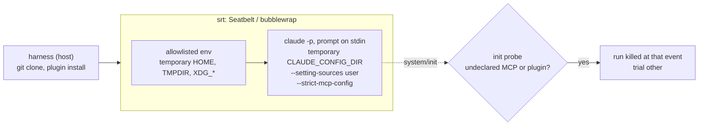

# Claude Code

The `claude-code` adapter runs `claude -p` in three layers, from the outside in to the agent:



```sh
export CLAUDE_CODE_OAUTH_TOKEN=…   # claude setup-token; never the keychain nor ~/.claude
npx proctor run suites/isolation-probe.eval.ts --agent claude-code            # srt sandbox by default
npx proctor run path/to/review.eval.ts --agent claude-code --case <case-id> --repeat 3 -j 3
```

| Layer | Page |
|---|---|
| sandbox (`srt`, `local-temp`) | [Sandboxes](../../sandboxes.md) |
| config layer (always on) | below |
| credential | [Auth](./auth.md) |
| plugins of a variant | [Plugins](./plugins.md) |
| init probe and isolation suite | [Isolation probe](./isolation-probe.md) |

## Config layer (always on)

| Flag or variable | Effect |
|---|---|
| `CLAUDE_CONFIG_DIR=<sandbox home>/.claude` | blank config; without it, the CLI would read the keychain entry of the host's default config |
| `--setting-sources user` | reads only the `settings.json` of that temporary directory: neither the host's, nor the `.claude/settings*.json` of the cloned repo |
| `--settings <json>` | the variant's settings (model, hooks) |
| `--strict-mcp-config --mcp-config <json>` | only the declared MCP servers, no claude.ai connector |
| `--plugin-dir <copy>` | directory plugin, **copied** into the sandbox home |
| `--no-session-persistence`, `--output-format stream-json --verbose` | nothing to resume; the stream is the transcript |
| prompt on **stdin**, not as an argument | `claude -p` reads it when no prompt is passed (checked offline: without stdin, "Input must be provided either through stdin or as a prompt argument"); no argument size limit (128 KiB on Linux), and srt does not re-quote the prompt (each `'` takes 5 bytes there); srt forwards stdin, tested by `srt.integration.test.ts` |
| `ENABLE_CLAUDEAI_MCP_SERVERS=false`, `CLAUDE_CODE_DISABLE_NONESSENTIAL_TRAFFIC=1`, `DISABLE_AUTOUPDATER=1` | no connector, telemetry or update |
| `CLAUDE_CODE_TMPDIR=<sandbox TMPDIR>` | otherwise the Bash tool writes under `/tmp/claude-<uid>`, shared with the host's sessions and denied under srt |

## Why neither `--bare` nor `--safe-mode`

Checked on CLI `2.1.280`:

| Candidate flag | Finding | Consequence |
|---|---|---|
| `--safe-mode` | loads a `--plugin-dir` but **without its skills or agents**, and skips all hooks | a plugin's slash commands (e.g. `/sdlc:review`) and hook-based plugins would not run |
| `--bare` | skips hooks, including those from `--settings`, and the discovery of the repo's `CLAUDE.md` files | same for hook-based plugins; a review skill would lose the repo's conventions |
| `--setting-sources ""` | blocks the resolution of installed plugins | a marketplace-installed plugin would not load |

The chosen combination keeps plugins, skills and hooks, and exposes only what the harness wrote into the temporary directory.
