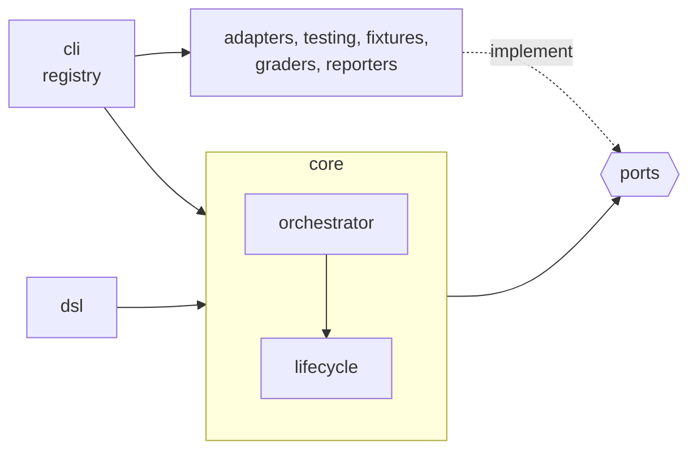

# Architecture

The core knows no agent, no sandbox, no concrete output format. Adding OpenCode must touch neither `src/core/` nor `src/ports/`.



## Source tree

```text
proctor/
├── bin/proctor.js        # registers tsx, then runs src/cli/main.ts: no build
├── src/
│   ├── ports/               # AgentAdapter, Sandbox, Grader, Fixture, Reporter, Workspace, run (results)
│   ├── core/
│   │   ├── model.ts         # definitions and zod schemas
│   │   ├── trial-summary.ts # trialLabel, countByStatus
│   │   ├── matrix.ts        # case × variant × repetition, filters
│   │   ├── orchestrator.ts  # beforeAll/afterAll, -j (p-limit), reporters
│   │   ├── lifecycle.ts     # one trial: hooks, try/finally, LIFO fixtures, status
│   │   ├── errors.ts · timeout.ts · duration.ts · exit-code.ts
│   ├── dsl/                 # fluent builders: suite, variant, case
│   ├── adapters/
│   │   ├── process.ts       # runs a command, explicit env, kills the group on abort and on exit
│   │   ├── redact.ts        # masks the credential and any Anthropic key in the stream
│   │   ├── agents/claude-code/
│   │   │   ├── adapter.ts       # version, prepare, run: env, sandbox wrap, transcript
│   │   │   ├── credentials.ts   # auth profiles, API domains per profile
│   │   │   ├── flags.ts         # AgentRunInput → CLI flags
│   │   │   ├── plugins.ts       # references (name, path, marketplace), copy, marketplace, fingerprint
│   │   │   ├── stream-parser.ts # stream-json → AgentRunResult, toolCalls
│   │   │   └── init-probe.ts    # system/init → undeclared MCP or plugin; undeclared SessionStart hook
│   │   └── sandboxes/
│   │       ├── temp-layout.ts         # root/{work,home,tmp} of a trial, allowlisted env
│   │       ├── local-temp/sandbox.ts  # the layout alone: isolation degraded
│   │       └── srt/{config,sandbox}.ts # srt policy, command wrapping
│   ├── auth/credential-resolver.ts  # picks the credential among the profiles the agent declares
│   ├── fixtures/{directory,git-repo}.ts
│   ├── graders/             # regex, tool-calls, transcript, json-path, file-changed (+ workspace-files),
│   │                        # tool-used, verdict-equals, answer-shape (+ yes-no-contract), limits, llm-judge (+ judge-protocol)
│   ├── reporters/           # ctrf(-types), aggregates, markdown and html (CTRF sinks), console, files
│   ├── loaders/             # registry, eval-ts, legacy-json, legacy-verdicts (oui/non → verdict, shape, judge on oui)
│   ├── testing/             # FakeAgentAdapter, FakeSandbox (export "@fluce/proctor/testing")
│   ├── shared/              # leaf utilities (fs, text, ids), importable by every layer
│   └── cli/                 # main (commander), run, report, list, registry, host, interrupt (Ctrl-C)
├── eslint/import-boundaries.js
├── scripts/fingerprint-claude-home.ts, rejudge.ts
├── examples/hello.eval.ts   # covered by test/cli.test.ts
├── suites/isolation-probe.eval.ts  # covered by test/isolation-probe.test.ts
└── test/                    # behavior tests (*.test.ts); unit specs sit next to the sources (*.spec.ts)
    ├── support/             # imported through #test/*: setup.ts (no network, no credential), helpers, ctrf-schema, typecheck
    └── fixtures/            # vendored ctrf.schema.json, recorded and anonymized stream-json/, fake-claude.sh that
                             # replays them, legacy/demo theme; srt.integration.test.ts runs the real srt
```

## Import boundaries

The `local/import-boundaries` lint rule blocks:
- any relative import that leaves the package root;
- any import of `adapters/`, `auth/`, `cli/`, `dsl/`, `fixtures/`, `graders/`, `loaders/`, `reporters/`, `testing/` or `src/index.ts` from `core/` or `ports/`, relative or by the package name (`proctor`, `@fluce/proctor/testing`);
- any import of `core/` from `ports/`: the ports are the innermost layer.

- Each layer lists what it **may** import: everything else is refused by default.
- `test/architecture.test.ts` relints the whole tree with `allowInlineConfig: false`: an `// eslint-disable` hides nothing in `npm test`.
- A computed `import(path)` is refused everywhere except `loaders/eval-ts.ts`, which loads the user's `*.eval.ts`.

The full set of rules, conventions and review checks is in [`CLAUDE.md`](https://github.com/Luce-Florian/proctor/blob/main/CLAUDE.md). How to set up a clone and open a pull request is in [`CONTRIBUTING.md`](https://github.com/Luce-Florian/proctor/blob/main/CONTRIBUTING.md).
