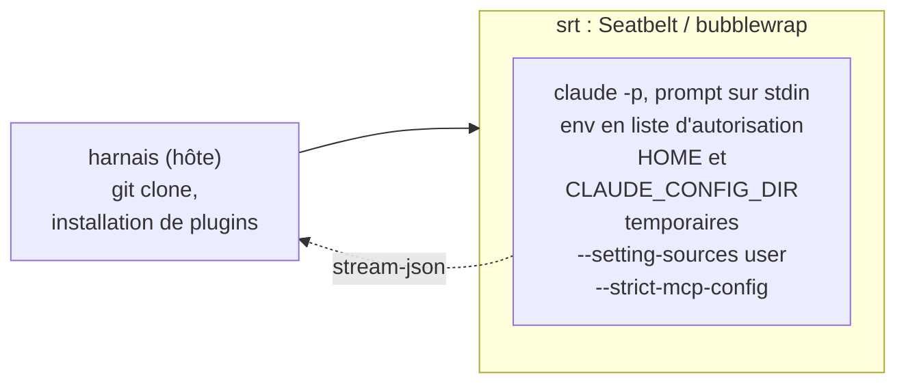
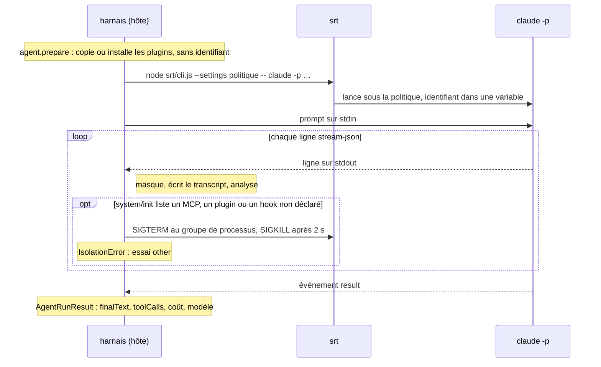

# Claude Code

L'adaptateur `claude-code` exécute `claude -p` dans trois couches, de l'extérieur vers l'agent :



Une exécution, dans l'ordre des appels :



```sh
export CLAUDE_CODE_OAUTH_TOKEN=…   # claude setup-token; never the keychain nor ~/.claude
npx proctor run suites/isolation-probe.eval.ts --agent claude-code            # srt sandbox by default
npx proctor run path/to/review.eval.ts --agent claude-code --case <case-id> --repeat 3 -j 3
```

| Couche | Page |
|---|---|
| sandbox (`srt`, `local-temp`) | [Sandboxes](../../sandboxes.md) |
| couche de config (toujours active) | ci-dessous |
| identifiant | [Authentification](./auth.md) |
| plugins d'une variante | [Plugins](./plugins.md) |
| sonde d'init et suite d'isolation | [Sonde d'isolation](./isolation-probe.md) |

## Couche de config (toujours active)

| Option ou variable | Effet |
|---|---|
| `CLAUDE_CONFIG_DIR=<sandbox home>/.claude` | config vierge ; sans elle, la CLI lirait l'entrée du trousseau de la config par défaut de l'hôte |
| `--setting-sources user` | ne lit que le `settings.json` de ce répertoire temporaire : ni celui de l'hôte, ni les `.claude/settings*.json` du dépôt cloné |
| `--settings <json>` | les réglages de la variante (modèle, hooks) |
| `--strict-mcp-config --mcp-config <json>` | seulement les serveurs MCP déclarés, aucun connecteur claude.ai |
| `--plugin-dir <copy>` | plugin sous forme de répertoire, **copié** dans le home de la sandbox |
| `--no-session-persistence`, `--output-format stream-json --verbose` | rien à reprendre ; le flux est le transcript |
| prompt sur **stdin**, pas en argument | `claude -p` le lit quand aucun prompt n'est passé (vérifié hors ligne : sans stdin, « Input must be provided either through stdin or as a prompt argument ») ; aucune limite de taille d'argument (128 Kio sous Linux), et srt ne re-quote pas le prompt (chaque `'` y prend 5 octets) ; srt transmet stdin, testé par `srt.integration.test.ts` |
| `ENABLE_CLAUDEAI_MCP_SERVERS=false`, `CLAUDE_CODE_DISABLE_NONESSENTIAL_TRAFFIC=1`, `DISABLE_AUTOUPDATER=1` | ni connecteur, ni télémétrie, ni mise à jour |
| `CLAUDE_CODE_TMPDIR=<sandbox TMPDIR>` | sinon l'outil Bash écrit sous `/tmp/claude-<uid>`, partagé avec les sessions de l'hôte et refusé sous srt |

## Pourquoi ni `--bare` ni `--safe-mode`

Vérifié sur la CLI `2.1.280` :

| Option candidate | Constat | Conséquence |
|---|---|---|
| `--safe-mode` | charge un `--plugin-dir` mais **sans ses skills ni ses agents**, et saute tous les hooks | les slash commands d'un plugin (par exemple `/sdlc:review`) et les plugins à base de hooks ne s'exécuteraient pas |
| `--bare` | saute les hooks, y compris ceux de `--settings`, et la découverte des fichiers `CLAUDE.md` du dépôt | idem pour les plugins à base de hooks ; une skill de review perdrait les conventions du dépôt |
| `--setting-sources ""` | bloque la résolution des plugins installés | un plugin installé depuis une marketplace ne se chargerait pas |

La combinaison retenue garde plugins, skills et hooks, et n'expose que ce que le harnais a écrit dans le répertoire temporaire.
