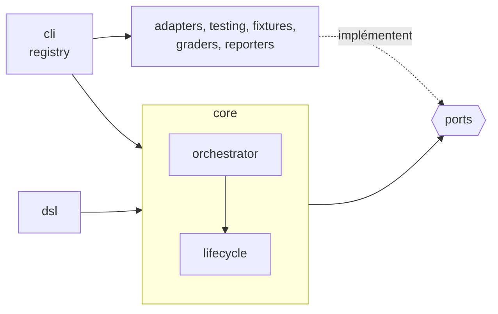

# Architecture

Le cœur ne connaît aucun agent, aucune sandbox, aucun format de sortie concret. Ajouter OpenCode ne doit toucher ni `src/core/` ni `src/ports/`.



## Arborescence des sources

```text
proctor/
├── bin/proctor.js        # enregistre tsx, puis lance src/cli/main.ts : pas de build
├── src/
│   ├── ports/               # AgentAdapter, Sandbox, Grader, Fixture, Reporter, Workspace, run (résultats)
│   ├── core/
│   │   ├── model.ts         # définitions et schémas zod
│   │   ├── trial-summary.ts # trialLabel, countByStatus
│   │   ├── matrix.ts        # cas × variante × répétition, filtres
│   │   ├── orchestrator.ts  # beforeAll/afterAll, -j (p-limit), reporters
│   │   ├── lifecycle.ts     # un essai : hooks, try/finally, fixtures LIFO, statut
│   │   ├── errors.ts · timeout.ts · duration.ts · exit-code.ts
│   ├── dsl/                 # builders fluents : suite, variante, cas
│   ├── adapters/
│   │   ├── process.ts       # lance une commande, env explicite, tue le groupe à l'annulation et à la sortie
│   │   ├── redact.ts        # masque l'identifiant et toute clé Anthropic dans le flux
│   │   ├── agents/claude-code/
│   │   │   ├── adapter.ts       # version, prepare, run : env, enveloppe de sandbox, transcript
│   │   │   ├── credentials.ts   # profils d'authentification, domaines d'API par profil
│   │   │   ├── flags.ts         # AgentRunInput → options de la CLI
│   │   │   ├── plugins.ts       # références (nom, chemin, marketplace), copie, marketplace, empreinte
│   │   │   ├── stream-parser.ts # stream-json → AgentRunResult, toolCalls
│   │   │   └── init-probe.ts    # system/init → MCP ou plugin non déclaré ; hook SessionStart non déclaré
│   │   └── sandboxes/
│   │       ├── temp-layout.ts         # root/{work,home,tmp} d'un essai, env en liste d'autorisation
│   │       ├── local-temp/sandbox.ts  # l'arborescence seule : isolation degraded
│   │       └── srt/{config,sandbox}.ts # politique srt, enveloppe de la commande
│   ├── auth/credential-resolver.ts  # choisit l'identifiant parmi les profils que déclare l'agent
│   ├── fixtures/{directory,git-repo}.ts
│   ├── graders/             # regex, tool-calls, transcript, json-path, file-changed (+ workspace-files),
│   │                        # tool-used, verdict-equals, answer-shape (+ yes-no-contract), limits, llm-judge (+ judge-protocol)
│   ├── reporters/           # ctrf(-types), aggregates, markdown et html (sinks CTRF), console, files
│   ├── loaders/             # registry, eval-ts, legacy-json, legacy-verdicts (oui/non → verdict, forme, juge sur oui)
│   ├── testing/             # FakeAgentAdapter, FakeSandbox (export "@fluce/proctor/testing")
│   ├── shared/              # utilitaires feuilles (fs, text, ids), importables par chaque couche
│   └── cli/                 # main (commander), run, report, list, registry, host, interrupt (Ctrl-C)
├── eslint/import-boundaries.js
├── scripts/fingerprint-claude-home.ts, rejudge.ts
├── examples/hello.eval.ts   # couvert par test/cli.test.ts
├── suites/isolation-probe.eval.ts  # couvert par test/isolation-probe.test.ts
└── test/                    # tests de comportement (*.test.ts) ; les specs unitaires sont à côté des sources (*.spec.ts)
    ├── support/             # importé via #test/* : setup.ts (ni réseau, ni identifiant), helpers, ctrf-schema, typecheck
    └── fixtures/            # ctrf.schema.json vendoré, stream-json/ enregistrés et anonymisés, fake-claude.sh qui
                             # les rejoue, thème legacy/demo ; srt.integration.test.ts lance le vrai srt
```

## Frontières d'import

La règle de lint `local/import-boundaries` bloque :
- tout import relatif qui sort de la racine du package ;
- tout import de `adapters/`, `auth/`, `cli/`, `dsl/`, `fixtures/`, `graders/`, `loaders/`, `reporters/`, `testing/` ou `src/index.ts` depuis `core/` ou `ports/`, en relatif ou par le nom du package (`proctor`, `@fluce/proctor/testing`) ;
- tout import de `core/` depuis `ports/` : les ports sont la couche la plus interne.

- `core/`, `ports/`, `shared/` et `test/` listent chacun ce qu'ils **peuvent** importer de `src/` : tout le reste, y compris un dossier ajouté plus tard, est refusé par défaut.
- `test/architecture.test.ts` relance le lint sur tout l'arbre avec `allowInlineConfig: false` : un `// eslint-disable` ne cache rien dans `npm test`.
- Un `import(path)` calculé est refusé partout sauf dans `loaders/eval-ts.ts`, qui charge le `*.eval.ts` de l'utilisateur.

L'ensemble des règles, conventions et contrôles de review se trouve dans [`CLAUDE.md`](https://github.com/Luce-Florian/proctor/blob/main/CLAUDE.md). La mise en place d'un clone et l'ouverture d'une pull request sont décrites dans [`CONTRIBUTING.md`](https://github.com/Luce-Florian/proctor/blob/main/CONTRIBUTING.md).
