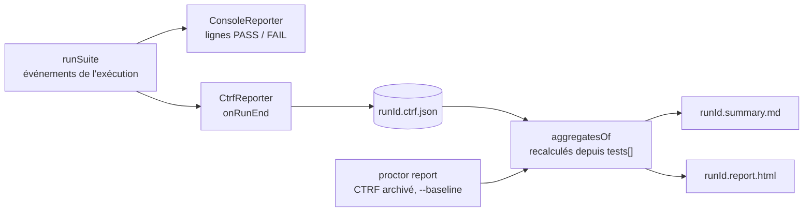

# Rapports et ablation

Une exécution écrit un seul CTRF, puis en dérive chaque rapport. `proctor report` les régénère à partir d'un CTRF archivé.



| Où | Contenu |
|---|---|
| `results.extra.aggregates.groups[]` | par cas × variante : voir [Agrégats](#agregats) |
| `results.extra.ablation[]` | Δ (variante − `--baseline`) des critères (en points de part), du score, du coût, du taux de réussite ; le Δ de taux de réussite est absent (« — ») quand un côté n'a aucun essai évalué, au lieu d'un faux ±100 pts |
| `<runId>.summary.md` | essais, agrégats, ligne du juge, ablation |
| `<runId>.report.html` (`--report html`, ou `proctor report <ctrf> --format html`) | page autonome : résumé et barre de statut, variantes et carte d'ablation, carte critères × essais (principal, leurre), essais, onglet CTRF brut ; clair et sombre ; seule requête : Google Fonts, optionnelle |

- Un CTRF antérieur aux agrégats fonctionne, et un `results.extra` modifié n'est jamais affiché tel quel.
- Les champs du CTRF sont listés dans la [Référence CTRF](./ctrf.md).

## Agrégats

Un groupe par cas × variante. Les essais évalués sont les `passed` et les `failed`.

| Agrégat | Sur quels essais | Valeur par essai |
|---|---|---|
| essais par statut | tous | — |
| critères | évalués, avec un critère | **part atteinte** : atteints / critères évalués dans cet essai, donc une garde fermée n'enlève aucun point |
| leurres | évalués, avec un leurre | leurres atteints / leurres |
| principal atteint | évalués, avec un principal | tous les principaux atteints ; un compte, « — » quand aucun essai n'en a |
| score | évalués, avec un score (son `n`) | moyenne des scores des évaluateurs, dans `[0, 1]` |
| coût, durée | évalués | coût de l'agent évalué seul ; durée de l'essai |
| appels du juge, coût du juge | tous, `other` compris | somme, relances comprises |

- Critères, leurres, score, coût et durée sont une moyenne ± écart type d'échantillon (n − 1) ; critères et leurres s'affichent en %.
- Un `non` parfait (3 critères) et un `oui` parfait (4) comptent tous deux 100 % de critères : voir le [loader historique](../legacy/loader.md).

## Rejuger

Rejugez une exécution archivée sans relancer l'agent (transcripts `claude-code`). La baseline archivée ne compte que les critères du juge (`grader: "judge"`) :

```sh
CLAUDE_CODE_OAUTH_TOKEN=… npm run rejudge -- results/<suite>/<runId>.ctrf.json path/to/suite.eval.ts --times 3 [--test "baseline] #1"]
```

`scripts/rejudge.ts` est un outil de campagne manuel, lancé depuis un clone de ce dépôt.
