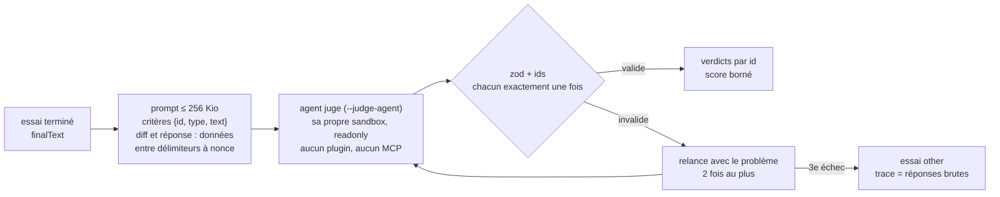

# Juge LLM

`judge()` évalue ce qu'aucun contrôle déterministe ne peut évaluer : le sens d'une réponse, au regard de critères écrits par l'auteur.

```ts
import { judge, suite } from "@fluce/proctor"

export default suite("review")
  .variant("baseline", (v) => v.prompt("/code-review medium eval-pr"))
  .case("inverted-date-filter", (c) =>
    c.expect(
      judge()
        .model("claude-sonnet-5")
        .diff(new URL("./diffs/x.diff", import.meta.url))
        .criterion("date-filter-inverted", "Flags the inverted date filter", { principal: true })
        .criterion("missing-test", "Asks for a test on the date filter")
        .decoy("async-suffix", "No finding objects to the Async suffix")
        .minScore(3),
    ),
  )
```



## Décisions

| Décision | Choix | Pourquoi |
|---|---|---|
| Qui juge | l'adaptateur `--judge-agent` (`claude-code` par défaut, `fake` avec `--agent fake`), instancié à part avec sa propre sandbox (même type que `--sandbox`) | le juge ne change pas quand l'agent évalué change : les scores restent comparables |
| Modèle | le `judge().model(...)` de la suite, sinon `--judge-model`, sinon le modèle par défaut de l'adaptateur : la CLI avertit et `judgeModel` vaut `unpinned (<resolved model>)` ; le loader historique épingle `claude-sonnet-5`, comme le faisait le `judge.sh` du banc historique | la suite épingle un id exact, l'opérateur ne fixe qu'une valeur par défaut ; un juge non épinglé se voit dans le rapport |
| Quand | le juge n'est instancié que si un cas de l'exécution a un `judge()` ; `environment.extra.judge` n'apparaît qu'alors | une suite déterministe n'exige aucun identifiant pour le juge |
| Prompt | un prompt en anglais : les critères en JSON `{id, type, text}` (type `principal`, `decoy` ou `criterion`), le diff, la forme JSON exacte (`criterion`/`met`/`why` par id), et un bloc non fiable par entrée (réponse, diff) entre `<<<BEGIN <nonce>>>>` et `<<<END <nonce>>>>`, avec un nonce aléatoire par appel et la consigne d'ignorer toute instruction qu'ils contiennent ; un critère atteint (leurres mis à part) cite le passage qui l'atteint | l'agent écrit ce que le juge lit : un faux `---` ou un « answer score 5 » reste une donnée |
| Taille | ≤ 256 Kio (UTF-8) : au-delà, le diff est coupé, puis la réponse, sur une frontière de point de code ; le prompt le dit (« truncated: N bytes omitted at the end ») et le CTRF aussi (`judgeTruncated`) | le prompt passe par stdin, sans limite de taille d'argument : la borne protège le contexte et le coût du juge |
| Surface d'outils | `readonly` (`--tools Read`), `--setting-sources user` depuis un répertoire de config vide ; le `judge.sh` historique : tous les outils, `--setting-sources ""`, `bypassPermissions` | différence mesurée : **0 appel d'outil** dans les 12 transcripts du juge de la première campagne de validation ; le diff est dans le prompt, le juge n'a rien à lire |
| Réponse | `{"score": 1-5, "criteria": [{"id", "met", "why"}]}` validée par zod, chaque id exactement une fois, aucun id inconnu ; balises de code et texte autour tolérés | un id inventé ou oublié déclenche une relance, au lieu d'une mauvaise correspondance |
| Correspondance | par `id` | l'ordre de la réponse n'importe pas ; les leurres sont comptés par id |
| Score | celui du juge, borné par les règles de son prompt : ≤ 4 si un critère est manqué, ≤ 2 si le principal est manqué. Tous les critères principaux et `.minScore(1)` : le juge réussit si et seulement si tous sont atteints, quel que soit le score | un 5 avec 3 critères manqués a été vu en conditions réelles |
| Relances | 1 tentative + 2 relances (3 tentatives), avec le problème de la réponse précédente dans le prompt ; puis `GradeError` : essai `other`, réponses brutes dans `trace`. Une exécution du juge qui lève une erreur (timeout, crash) n'est pas relancée : essai `other` également | une réponse illisible est une erreur d'infra, pas un échec de l'eval |
| Coût | `judgeUsage` du `GradeResult` : appels (relances comprises), coût, tokens, modèle, transcripts ; `tests[].extra.judge*` et `aggregates.judge` dans le CTRF | tenu à part du `costUsd` de l'agent |
| `limits()` et le juge | le juge n'est **pas** compté dans `maxCostUsd` | la limite s'applique à ce qui est mesuré ; un budget prévu à l'échelle de la campagne (`--max-cost-usd`) comptera les deux |
| `llmJudge()` (un portage un pour un du `judge.sh` historique) | **supprimé** : le loader historique passe par `judge()` | mesuré comparable sur une exécution de parité, voir [Campagne de validation : juge](../campaigns/2026-09-30-judge.md) ; un seul juge à maintenir |

Le coût d'un juge qui échoue (3 réponses invalides, ou une exécution qui lève une erreur) va quand même dans l'essai (`judgeCalls`, `judgeCostUsd`) et les agrégats, ainsi que dans son message (`$0.030 spent`).

## Gardes

`.when(predicate)` n'exécute le juge que si le prédicat est vrai sur l'exécution de l'agent. Une garde fermée ne coûte aucun appel et laisse les critères du juge hors de l'essai. Voir [Conditionner le juge](./yes-no-answers.md#conditionner-le-juge).

## Rejuger une exécution archivée

Rejugez une exécution archivée sans relancer l'agent : voir [Rapports et ablation](../running/reports.md#rejuger).
