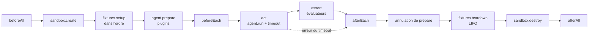

# Cycle de vie

Chaque essai suit l'ordre xUnit. Le nettoyage s'exécute toujours pour ce qui a été mis en place, quoi qui ait échoué avant.

## Ce qui s'exécute où

| Étape | S'exécute | Pourquoi |
|---|---|---|
| fixtures (`gitRepo` : `git` avec l'env de l'hôte), `agent.prepare` (installation de plugins : env de la sandbox, aucun identifiant, réseau ouvert), hooks de suite et de variante, évaluateurs | **hors** de la sandbox de l'agent | ils ont besoin des identifiants git ou du réseau, et le harnais leur fait confiance ; rien de ce qu'écrit l'agent ne s'y exécute |
| `agent.run` | dans la sandbox | l'agent évalué n'est pas fiable |

## Ordre et nettoyage

- `afterEach` s'exécute dès que les fixtures sont en place et l'agent préparé, même si `beforeEach` lève une erreur.
- `sandbox.create` reçoit `access` : ce que l'agent (`sandboxAccess`) et la suite (`.allowDomains`, `.allowRead`, `.allowWrite`) doivent laisser passer.
- Les évaluateurs reçoivent le juge de l'exécution (`RunOptions.judge` : son agent, sa sandbox, son modèle par défaut), jamais l'agent évalué.
- `grader.prepare(workspace)`, optionnel, s'exécute juste avant l'agent, après `beforeEach` : c'est là que `fileChanged` prend son instantané.
- Un reporter qui lève une erreur dans `onTrialEnd` n'arrête pas l'exécution : l'erreur va dans `suiteErrors`.
- Un `afterAll` en échec ne change aucun essai : il va dans `suiteErrors`, écrit dans le `results.extra` du CTRF et en bas du résumé.

## Timeouts et interruption

- Au timeout, le signal passé à l'agent est annulé et l'essai devient `other` (`agent run failed: timed out after 1m: raise the case .timeout(...)…`).
- Le nettoyage attend que l'agent s'arrête, 5 s au plus (`ABORT_GRACE_MS`), pour ne pas démonter un espace de travail dans lequel il écrit encore.
- Une interruption (`runSuite({ signal })`, Ctrl-C dans la CLI) suit le même chemin : l'agent, `prepare` et le juge reçoivent le signal, l'essai en cours devient `other` après ses nettoyages, les suivants ne démarrent pas.
- Une exécution d'agent en échec garde son transcript : `AgentRunError.transcriptPath` remonte dans `TrialResult.transcriptPath` et dans le `extra.transcript` du CTRF.
- Chaque commande lancée a son propre groupe de processus : à l'annulation, SIGTERM puis SIGKILL après 2 s ; à la sortie normale, ce qu'elle a laissé en arrière-plan est tué.

## Statuts

| Statut | Quand |
|---|---|
| `passed` | tous les évaluateurs réussissent |
| `failed` | un évaluateur renvoie `passed: false`, ou un critère `principal` est manqué même si l'évaluateur dit `passed` ; le message liste les critères manqués |
| `other` | erreur d'infra : sandbox, fixture, `prepare`, hook, agent, sonde d'init, évaluateur qui lève une erreur, timeout, `beforeAll` ; ou rien n'a été évalué |
| `skipped` | `.skip()` ; aucune sandbox créée |
