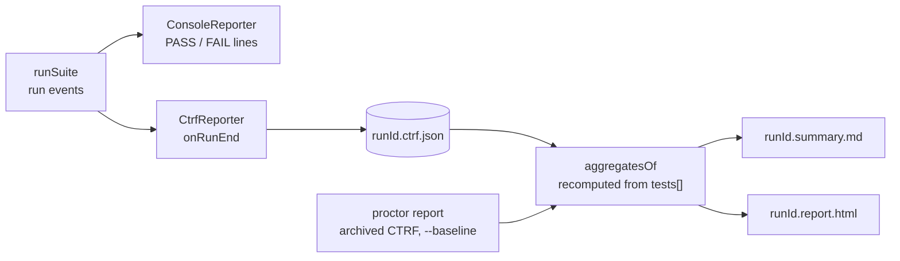

# Reports and ablation

A run writes a single CTRF, then derives every report from it. `proctor report` regenerates them from an archived CTRF.



| Where | Content |
|---|---|
| `results.extra.aggregates.groups[]` | per case × variant: see [Aggregates](#aggregates) |
| `results.extra.ablation[]` | Δ (variant − `--baseline`) of criteria (in share points), score, cost, pass rate; the pass-rate Δ is absent ("—") when one side has no graded trial, instead of a false ±100 pts |
| `<runId>.summary.md` | trials, aggregates, judge line, ablation |
| `<runId>.report.html` (`--report html`, or `proctor report <ctrf> --format html`) | standalone page: summary and status bar, variants and ablation card, criteria × trials map (principal, decoy), trials, raw CTRF tab; light and dark; the only request: Google Fonts, optional |

- A CTRF that predates the aggregates works, and an edited `results.extra` is never displayed as is.
- The fields of the CTRF are listed in the [CTRF reference](./ctrf.md).

## Aggregates

One group per case × variant. Graded trials are the `passed` and `failed` ones.

| Aggregate | Over which trials | Value per trial |
|---|---|---|
| trials by status | all | — |
| criteria | graded, with a criterion | **share met**: met / criteria graded in that trial, so a closed gate takes no point away |
| decoys | graded, with a decoy | decoys met / decoys |
| principal met | graded, with a principal | every principal met; a count, "—" when no trial has one |
| score | graded, with a score (its `n`) | mean of the grader scores, in `[0, 1]` |
| cost, duration | graded | cost of the evaluated agent only; trial duration |
| judge calls, judge cost | all, `other` included | sum, retries included |

- Criteria, decoys, score, cost and duration are a mean ± sample standard deviation (n − 1); criteria and decoys show as %.
- A perfect `non` (3 criteria) and a perfect `oui` (4) both count as 100% criteria: see the [legacy loader](../legacy/loader.md).

## Rejudge

Judge an archived run again without rerunning the agent (`claude-code` transcripts). The archived baseline only counts the judge's criteria (`grader: "judge"`):

```sh
CLAUDE_CODE_OAUTH_TOKEN=… npm run rejudge -- results/<suite>/<runId>.ctrf.json path/to/suite.eval.ts --times 3 [--test "baseline] #1"]
```

`scripts/rejudge.ts` is a manual campaign tool, run from a clone of this repo.
