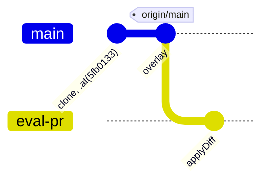

# Fixtures

A fixture prepares the workspace before the agent runs. Fixtures run on the host, outside the agent's sandbox, in declaration order; their teardown runs in reverse order (LIFO).

| Fixture | Effect |
|---|---|
| `directory(url, { into? })` | copies a directory's content into the workspace, or into its `into` subdirectory; teardown removes only what the copy created |
| `gitRepo(url).ref(b).at(sha).diff(f)` or `.applyDiff(f)`, `.overlay(dir)` | clones a repository and prepares a pull request to review: see below |

## `gitRepo`

A port of the legacy bench's `run.sh`.

| Step | Effect |
|---|---|
| clone | `git clone --depth 1 --branch <ref>` into the workspace, by the harness with the host's git credentials, outside the agent's sandbox |
| `.at(sha)` | `fetch` then `checkout` of the exact commit |
| `.diff(f)` | copied as `eval-pr.diff`, not applied |
| `.overlay(dir)` | copied at the root and committed on the base; `origin/<ref>` pinned, fetch refspec neutralized |
| `.applyDiff(f)` | one commit on the `eval-pr` branch, then `eval-pr.diff` deleted |
| always | `eval-pr.diff`, `eval-spec.md`, `.claude/settings.local.json` in `.git/info/exclude`; commits without signature or hooks |

With `.at(sha).overlay(dir).applyDiff(f)`, the agent starts on `eval-pr`, one commit ahead of a pinned `origin/main`:

- Paths are `new URL(…, import.meta.url)`: they resolve from the `*.eval.ts` file, not from the working directory.
- A fixture (`git clone`) does not receive the interruption signal: see [Known limitations](../limitations.md).
