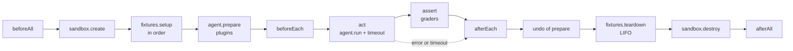

# Lifecycle

Each trial follows the xUnit order. Cleanup always runs for what was set up, whatever failed before.

## What runs where

| Step | Runs | Why |
|---|---|---|
| fixtures (`gitRepo`: `git` with the host env), `agent.prepare` (plugin install: sandbox env, no credential, open network), suite and variant hooks, graders | **outside** the agent's sandbox | they need git credentials or the network, and the harness trusts them; nothing the agent writes runs there |
| `agent.run` | inside the sandbox | the evaluated agent is untrusted |

## Order and cleanup

- `afterEach` runs as soon as the fixtures are set up and the agent prepared, even if `beforeEach` throws.
- `sandbox.create` receives `access`: what the agent (`sandboxAccess`) and the suite (`.allowDomains`, `.allowRead`, `.allowWrite`) must let through.
- Graders receive the run's judge (`RunOptions.judge`: its agent, its sandbox, its default model), never the evaluated agent.
- `grader.prepare(workspace)`, optional, runs just before the agent, after `beforeEach`: `fileChanged` takes its snapshot there.
- A reporter that throws in `onTrialEnd` does not stop the run: the error goes into `suiteErrors`.
- A failed `afterAll` changes no trial: it goes into `suiteErrors`, written to the CTRF's `results.extra` and at the bottom of the summary.

## Timeouts and interruption

- On timeout, the signal passed to the agent is aborted and the trial becomes `other` (`agent run failed: timed out after 1m: raise the case .timeout(...)…`).
- Cleanup waits for the agent to stop, 5 s at most (`ABORT_GRACE_MS`), so as not to tear down a workspace it is still writing to.
- An interruption (`runSuite({ signal })`, Ctrl-C in the CLI) follows the same path: the agent, `prepare` and the judge receive the signal, the running trial becomes `other` after its cleanups, the next ones do not start.
- A failed agent run keeps its transcript: `AgentRunError.transcriptPath` goes up into `TrialResult.transcriptPath` and the CTRF's `extra.transcript`.
- Each launched command has its own process group: on abort, SIGTERM then SIGKILL after 2 s; on normal exit, whatever it left in the background is killed.

## Statuses

| Status | When |
|---|---|
| `passed` | all graders pass |
| `failed` | a grader returns `passed: false`, or a `principal` criterion is missed even if the grader says `passed`; the message lists the missed criteria |
| `other` | infra error: sandbox, fixture, `prepare`, hook, agent, init probe, grader that throws, timeout, `beforeAll`; or nothing was graded |
| `skipped` | `.skip()`; no sandbox created |
